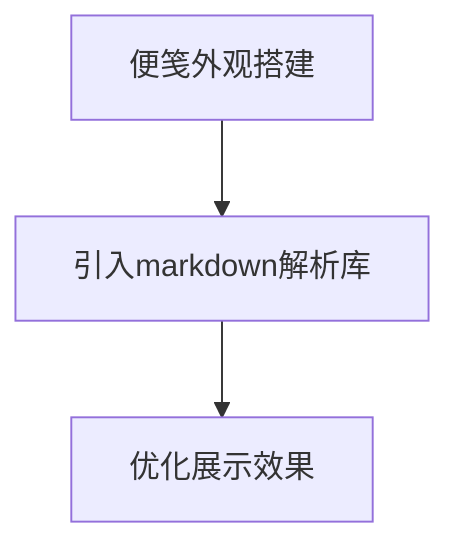

# MeMoMark

记录一下开发electron应用遇见的一些问题和实现想法

# 想法：

实现一个支持markdown的electron应用，类似MacBook自带的便笺

# 遇见的问题

很多问题是因为GFW😠

- electron大陆安装不行，最好换成阿里镜像源或者用cnpm
- 使用**commitizen报错：**

[git commit规范及自动检查工具安装小记 - 掘金](https://juejin.cn/post/6844904033635794958)

> 解决方法：
> 
> 
> ```jsx
> cnpm install cz-conventional-changelog --save-dev --save-exact
> ```
> 
> 再手动配置一下：
> 
> ```jsx
> "config": {
> "commitizen": {
> "path": "./node_modules/cz-conventional-changelog"
> 	}
> }
> ```
> 

## 前言

最近换了台MacBook Air，发现内置了一个“便笺”的app，感觉蛮不错的，平时可以用来做个每日计划啥的，但最让我不满意的一个点就是**不支持markdown**！导致每次下意识的去使用markdown语法的时候就很别扭，类似这样：


看着就很别扭，加上样式也不算很美观，诶🤓👆，不如自己DIY一个？说干就干，[**Electron**](https://www.electronjs.org/zh/)，启动！

## 架子搭好

这部分不愿意过多的去说，咱主要还是以实现这个支持markdown的便笺和优化功能为主，这里直接看官方文档即可：[https://www.electronjs.org/zh/docs/latest/tutorial/quick-start](https://www.electronjs.org/zh/docs/latest/tutorial/quick-start)

## 功能实现

> 需求分析：支持markdown的便笺
> 

根据我们自己给自己创建的需求，来做个简单的流程图：



这里为了控制大小，就不要再引入框架了，直接使用electron来实现相关功能就行：

```html
<!DOCTYPE html>
<html lang="en">

<head>
  <meta charset="UTF-8">
  <meta name="viewport" content="width=device-width, initial-scale=1.0">
  <title>Markdown Notepad</title>
  <style>
    body {
      display: flex;
      height: 100vh;
      margin: 0;
      font-family: Arial, sans-serif;
    }

    #markdown-input,
    #markdown-preview {
      flex: 1;
      padding: 20px;
      box-sizing: border-box;
      height: 100%;
      overflow-y: auto;
    }

    #markdown-input {
      border-right: 1px solid #ddd;
    }

    #markdown-preview {
      padding-left: 40px;
    }
  </style>
</head>

<body>
  <textarea id="markdown-input" placeholder="Enter Markdown here..."></textarea>
  <div id="markdown-preview"></div>
</body>

</html>
```

这时候我们注意到，上方一直会有一个窗口栏在那，相比较Mac上的便笺来说，显得就很不优雅，这时候就可以通过调整main.js（*负责创建窗口和处理系统事件*）来修改我们创建的窗口：

```jsx
const { app, BrowserWindow, ipcMain } = require('electron');
const path = require('path');

let win; // 修改变量名以符合下文使用

function createWindow() {
  // 创建一个无边框的浏览器窗口
  win = new BrowserWindow({
    width: 320,
    height: 320,
    frame: false, // 设置窗口无边框
    webPreferences: {
      nodeIntegration: true,
      contextIsolation: false,
    }
  });
```

通过设置[BrowserWindow](https://www.electronjs.org/zh/docs/latest/api/browser-window#new-browserwindowoptions)中的frame属性，便可以让窗口边框消失了


接下来，让我们进入下一步，即引入解析Markdown语法的库。在这里，我们选择了Marked。Marked是一个功能强大的JavaScript库，它可以将Markdown文本解析为HTML。它的优点包括速度快，轻量级，同时它支持Github风格的Markdown语法，也支持自定义渲染。这些优点使得Marked成为我们的首选。

```bash
npm install marked
```

让我们在renderer.js中处理一下前端逻辑：

```jsx
mdInput.addEventListener('input', function () {
  const renderedHtml = marked.parse(mdInput.value);
  mdPreview.innerHTML = renderedHtml;
});
```

OK，再稍微修改一下HTML，让我们来看看，功能是不是实现了：


好了，功能没问题！成功渲染！

## 进一步优化

现在用着是不是感觉还是不太对劲？这样子左侧一块，右侧一块的，一点都不优雅，那让我们来修改一下，做个按钮来切换编辑和渲染这两个状态：

```html
  <div id="app-container">
    <textarea id="markdown-input" placeholder="Enter Markdown here..."></textarea>
    <div id="markdown-preview"></div>
    <div class="buttons-container">
      <button id="toggle-pin" class="toggle-button">📌 Toggle Pin</button>
      <button id="toggle-preview" class="toggle-button">👌🏻 Preview</button>
    </div>
  </div>
```

将前端逻辑仍然写在renderer.js中，在处理这个逻辑：

```jsx
togglePreviewBtn.addEventListener('click', () => {
  isPreviewMode = !isPreviewMode; // 直接切换预览模式状态
  if (isPreviewMode) {
    mdInput.style.display = 'none';
    mdPreview.style.display = 'block';
    togglePreviewBtn.textContent = '✏️  Edit';
  } else {
    mdInput.style.display = 'block';
    mdPreview.style.display = 'none';
    togglePreviewBtn.textContent = '👌🏻 Preview';
  }
});
```

OK，功能实现，相信细心的读者已经发现了这里还多了一个“**📌 Toggle Pin”**的按钮，既然要让他作为便利贴的存在，那自然要给他置顶的功能咯，这里便可以利用Electron的一个重要功能——[进程间通信 (IPC)](https://www.electronjs.org/zh/docs/latest/tutorial/ipc)

> 进程间通信 (IPC) 是在 Electron 中构建功能丰富的桌面应用程序的关键部分之一。 由于主进程和渲染器进程在 Electron 的进程模型具有不同的职责，因此 IPC 是执行许多常见任务的唯一方法，例如从 UI 调用原生 API 或从原生菜单触发 Web 内容的更改。
> 

这里我们主要的思路是："Toggle Pin" 功能通过渲染进程监听按钮点击，切换窗口置顶状态，并通过Electron的IPC机制发送消息给主进程，由主进程执行实际的置顶操作，下面是实际代码：

```jsx
// main.js

const { app, BrowserWindow, ipcMain } = require('electron');

//.....

// 监听从渲染进程发来的toggle-pin消息
ipcMain.on('toggle-pin', (event, shouldPin) => {
  if (win) {
    win.setAlwaysOnTop(shouldPin); // 设置窗口是否置顶
  }
});

// renderer.js
togglePinBtn.addEventListener('click', () => {
  isWindowPinned = !isWindowPinned;
  ipcRenderer.send('toggle-pin', isWindowPinned);
  togglePinBtn.textContent = isWindowPinned ? '📌 Toggle Pin' : '📄 Just Paper';
});
```

再让我们来稍微的优化一下样式，运行Electron看看最终功能：


至此，功能已经全部完成

## 打包构建

这里我们使用electron-builder来进行打包，在package.json中配置一下既可：

```json
"build": {
    "appId": "com.yourdomain.memomark",
    "mac": {
      "category": "public.app-category.productivity",
      "icon": "assets/MemoMark.icns" // 你的logo
    },
    "dmg": {
      "title": "MemoMark",
      "icon": "assets/MemoMark.icns",
      "window": {
        "width": 600,
        "height": 400
      }
    },
```

注意，Mac端的logo格式为icns，别弄错了哦~

运行打包构建命令：

```bash
npm run dist
```


打包成功！安装之后便可以在本地使用自己开发的Electron应用了~

## 总结和一些小遗憾

在选择用于构建桌面应用的框架时，不仅需要考虑其功能性，还需要考虑其性能、运行时大小、开发经验等因素。以下是Electron和Tauri的详细对比：

|  | Electron | Tauri |
| --- | --- | --- |
| 体积 | Electron的最小可执行文件体积约为50MB，这是由于它依赖于完整的Chromium和Node.js运行时。 | Tauri的一个显著优势是其小巧的体积。一个基本的Tauri应用的体积在几百KB到1-2MB之间。 |
| 速度 | Electron的速度受到其大体积的影响，因为需要加载完整的Chromium和Node.js运行时。 | Tauri由Rust编写，因此运行速度快，启动时间短。 |
| 安全性 | Electron的安全性取决于开发者如何使用它。不当使用可能导致安全漏洞，例如在渲染器进程中直接使用Node.js API。 | Tauri的设计理念是安全优先，它采用了一种严格的安全模型，包括禁止直接从渲染器访问Node.js API。 |
| 社区 | Electron由GitHub开发，拥有大量的用户和成熟的社区。它有大量的文档和教程。 | Tauri是一个相对较新的项目，其社区正在快速发展，但目前仍不如Electron成熟。 |
| 兼容性 | Electron支持Windows、macOS和Linux。 | Tauri也支持Windows、macOS和Linux。 |
| 开发经验 | Electron支持HTML、CSS和JavaScript，因此前端开发者可以很快上手。 | Tauri允许使用任何可以编译成静态HTML、CSS和JavaScript的前端框架，因此它对前端开发者来说是非常灵活的。 |
| 内存使用 | Electron的内存使用较高，因为每个Electron应用都需要运行自己的Chromium和Node.js实例。 | Tauri的内存使用相对更低，因为它不依赖于重量级的运行时环境。 |

就我实现的这个支持markdown的便笺，大小便已经达到了237mb（当然也可能是我没有进行优化），如果用Tauri的话，大小或许会控制的更好，这也是这个项目最大的遗憾了

如果你对这个项目感兴趣，或许你可以点进去看看https://github.com/isolcat/MemoMark，如果能够下载下来体验一下，提issues或者pr就更好了，希望这款支持markdown的Electron便笺应用能够帮助到你~
