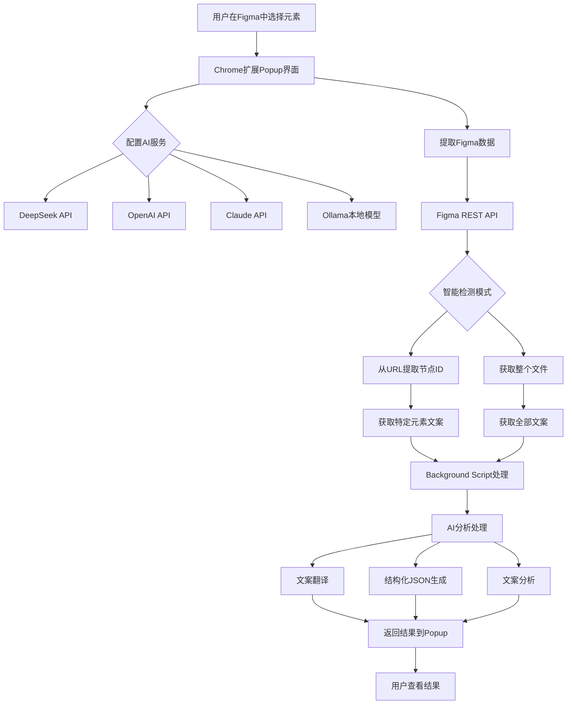
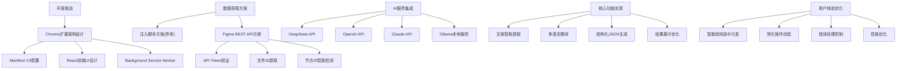
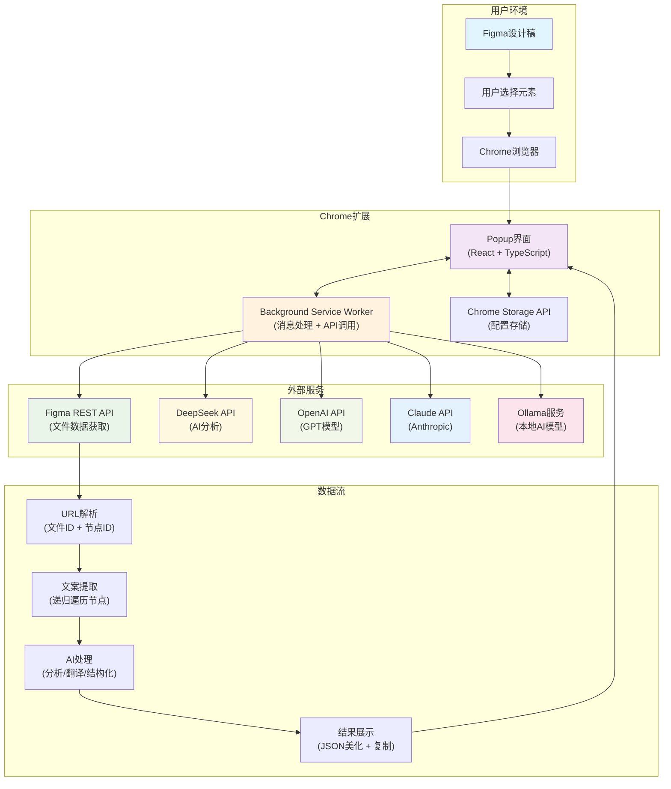

# 前言

> “每次看到设计师在 Figma 里复制粘贴文案，我就想写个工具帮他们...”

### 现实中的开发困境

想象一下这个场景：你是一个前端开发工程师，设计师给你发来一个 Figma 设计稿，里面有几十个页面，每个页面都有大量的文案内容。而你的业务是面对国际化的，需要生成一个原始的 JSON 文案去找翻译的同学来帮你翻译成各个国家的语言 🤯 并且这个 JSON 要根据你具体的项目来调整格式。

很快，你需要做的任务如下：

1. **手动复制文案** - 在 Figma 中一个个点击文本，复制粘贴到代码里
2. **整理成 JSON 格式** - 手动整理成前端可用的多语言文件格式
3. **翻译成多种语言** - 还要找翻译工具逐个翻译
4. **保持数据结构一致** - 确保所有语言版本的键值对应正确

这个过程不仅效率低下，还容易出错。更要命的是，**当设计师修改了文案，你又要重复一遍这个痛苦的过程...这无疑是很不高效的行为**

那么这时候，作为一个有“懒癌”的程序员，我开始思考如何提高开发效率：

- 能否自动从 Figma 提取文案？
- 能否直接调用 AI 进行智能分析和翻译？
- 能否一键生成前端需要的多语言 JSON 文件？

于是，这个 React Figma AI Chrome 扩展项目就诞生了。

## 💡 从痛点到解决方案

作为一个经常被奇奇怪怪的需求“折磨”的开发者，我深知一个道理：**好的工具都是从解决真实痛点开始的**。现在让我们把刚才提到的痛点重新梳理一下，但这次我们要从“程序员思维”的角度来分析：

**需求 1：自动化文案提取**

- 痛点：手动复制粘贴，效率低下，特别是我开发的时候，有时候面对一些游戏规则页（比如一整页的文字说明搭配几个表格的那种），光是复制 + 整理成完整的 JSON 就已经足够痛苦了，基本上一个内容多的说明页，去创建一个符合规范的 JSON 就需要十分钟左右了 😭
- 解决思路：通过 Chrome 扩展直接访问 **Figma API，自动提取页面文案**，这样就节省掉我们复制粘贴的时间了

**需求 2：智能文案处理**

- 痛点：文案需要结构化整理，还要翻译。像往常我开发的时候，除了自己手动去整理以外，最常用的方式就是让 AI 去帮我整理成一个可以开发的 JSON，但往往需要手动去输入一大堆 **Prompt**，才可以生成一个勉强够用的。或者你会说：“哥们！你弄到备忘录里，需要的时候再弄不就成了吗？”那我问你，这样优雅吗？每次都需要从备忘录里找到 **Prompt**，然后调整项目的描述 or 项目需要的 JSON 格式，这也太繁琐了吧…
- 解决思路：接入 AI 服务，让 AI 帮我们干“脏活累活”，最好可以留出 **调整项目描述和 JSON 格式的区域**

**需求 3：一键生成多语言 JSON**

- 痛点：手动整理 JSON 格式，容易出错
- 解决思路：让 AI 直接输出标准化的 JSON 格式，并且支持多语言翻译

那么现在我们的开发思路就已经定好了：


# 开发流程

## 初始化项目

```bash
mkdir figma-analyzer-extension
cd figma-analyzer-extension
npm init -y
```

开发技术栈选择方面，因为我先前一直是写 Vue 的，对 React 始终保持着好奇，但因为工作原因，一直没有机会去用到这个传奇的前端库，所以这次自己的小项目就选择了 React 来进行开发了。至于打包工具方面，就选择我们熟悉的 Vite 来进行打包构建就好～

除了这些主要的技术栈，我们还要根据我们的项目需求来选择一些有趣又有用的库，belike：

```markdown
- `@crxjs/vite-plugin`：专为 Chrome 扩展优化的 Vite 插件（**开发 Chrome extension 的神器！**）
- `@types/chrome`：Chrome 扩展 API 的 TypeScript 类型定义
- `react-json-pretty`：用来美化显示 JSON 结果，方便我们直接在插件里浏览 AI 生成的 JSON，这个 JSON-pretty 足够 **轻量美观**
```

中间的一些细节就省略掉了，如果感兴趣的话可以查看 [Chrome 扩展官方文档](https://developer.chrome.com/docs/extensions/) ，基本上和我们的也大差不多。

在稍作调整后，我们的这个项目结构如下：

```markdown
figma-analyzer-extension/
├── src/
│   ├── components/          # React 组件
│   │   └── FigmaAnalyzer.tsx
│   ├── manifest.json        # Chrome 扩展配置文件（重要！）
│   ├── popup.html          # 扩展弹窗的 HTML
│   ├── popup.tsx           # React 应用入口
│   ├── popup.css           # 样式文件
│   ├── background.ts       # Service Worker（后台脚本）
│   ├── types.ts            # TypeScript 类型定义
│   ├── constants.ts        # 常量定义
│   ├── prompts.ts          # AI 提示词模板
│   ├── figmaApi.ts         # Figma API 服务
│   └── vite-env.d.ts       # Vite 环境类型定义
├── package.json
├── tsconfig.json
├── tsconfig.node.json
├── vite.config.ts
└── README.md
```

> 这里之所以把 prompt 单独放在一个 ts 文件，是因为我们需要根据不同的功能来拆分不同的 prompt，并且需要根据用户的具体使用场景来调整 prompt。如果放在 React 组件中，会让整个项目看上去非常的臃肿，所以这里单独进行拆分了。

## 接入大模型之我全都要

Wait？！我们是不是忘记了一个很重要的事情？选择什么大模型呢？如果太贵了会不会得不偿失呢？市面上的大模型也太多了吧…选择困难症了 🤡

```jsx
// 程序员的内心独白
const aiServices = {
  openai: { price: '💰💰💰', quality: '🌟🌟🌟🌟🌟', speed: '🚀🚀🚀' },
  claude: { price: '💰💰', quality: '🌟🌟🌟🌟🌟', speed: '🚀🚀' },
  deepseek: { price: '💰', quality: '🌟🌟🌟🌟', speed: '🚀🚀🚀' },
  ollama: { price: '🆓', quality: '🌟🌟🌟', speed: '🐌' },
};

// 最后决定：小孩才做选择，成年人表示，我全都要！
const solution = '让用户自己选择，我们都支持';
```


那我们来简单实现一下 **AI 调用模块**：

```jsx
// 支持多种 AI 服务的统一接口
const callAI = async (prompt, provider) => {
  switch (provider) {
    case 'openai':
      return await callOpenAI(prompt);
    case 'deepseek':
      return await callDeepSeek(prompt);
    // ... 其他服务
  }
};
```

接着让我们实现一下接入 AI 大模型，这里选择性价比最高的 deepseek 来作为示例（其他的大模型同理）：

```jsx
function buildPrompt(request: AIAnalysisRequest): string {
  const { operation, figmaData, projectDescription, targetLanguage } = request;

  if (operation === 'translate') {
    // 纯翻译模式
    const textsToTranslate = figmaData.texts.map((t) => t.text).join('\n');
    const targetLang = getLanguageName(targetLanguage || 'en');
    const additionalInstruction = `\n\n**最终提醒**：以上共 ${figmaData.texts.length} 行文案，每行输出格式必须是：英文原文：${targetLang}译文`;

    return (
      TRANSLATION_PROMPT_TEMPLATE.replace(/\{targetLanguage\}/g, targetLang).replace(
        '{textsToTranslate}',
        textsToTranslate
      ) + additionalInstruction
    );
  } else if (operation === 'translate-and-structure') {
    // 翻译 + 结构化模式
    const allTextsFormatted = figmaData.texts
      .map((text, index) => `${index + 1}. "${text.text}"`)
      .join('\n');

    const projectDesc = projectDescription || '网页界面设计项目';
    const targetLang = getLanguageName(targetLanguage || 'en');
    const strictReminder = `\n\n**再次强调**：请确保 JSON 中只包含上述 ${figmaData.totalTextCount} 条提取文案的翻译版本，不要添加任何额外内容！`;

    return (
      TRANSLATE_AND_STRUCTURE_PROMPT_TEMPLATE.replace(/\{targetLanguage\}/g, targetLang)
        .replace('{textCount}', figmaData.totalTextCount.toString())
        .replace('{allTexts}', allTextsFormatted)
        .replace('{projectDescription}', projectDesc) + strictReminder
    );
  } else {
    // 结构化 JSON 生成模式
    const allTextsFormatted = figmaData.texts.map((text) => text.text).join('\n');
    const projectDesc = projectDescription || '网页界面设计项目';
    const strictReminder = `\n\n**再次强调**：请确保 JSON 中只包含上述 ${figmaData.totalTextCount} 条提取的文案，不要添加任何额外内容！`;

    return (
      ANALYSIS_PROMPT_TEMPLATE.replace('{textCount}', figmaData.totalTextCount.toString())
        .replace('{allTexts}', allTextsFormatted)
        .replace('{projectDescription}', projectDesc) + strictReminder
    );
  }
}

// DeepSeek API 调用实现
async function callDeepSeekAPI(prompt: string, apiKey: string): Promise<string> {
  const requestBody = {
    model: 'deepseek-chat',
    messages: [{ role: 'user', content: prompt }],
    temperature: 0.2, // 降低温度提高一致性
    max_tokens: 2000,
  };

  console.log('🚀 发送到 DeepSeek 的请求:', requestBody);

  const response = await fetch('https://api.deepseek.com/v1/chat/completions', {
    method: 'POST',
    headers: {
      Authorization: `Bearer ${apiKey}`,
      'Content-Type': 'application/json',
    },
    body: JSON.stringify(requestBody),
  });

  if (!response.ok) {
    const errorText = await response.text();
    console.error('DeepSeek API Error:', errorText);
    throw new Error(`DeepSeek API 错误: ${response.status}`);
  }

  const data = await response.json();
  const content = data.choices[0]?.message?.content;

  if (!content) {
    throw new Error('DeepSeek API 返回空内容');
  }

  return content;
}
```

## 接入 Ollama 时，遇见阻碍

当我兴高采烈地接入一个又一个主流大模型的时候，也同时考虑到了这个免费的工具，不仅可以本地调用大模型，还可以保证信息的隐私，来处理一些敏感需求的话，Ollama 再合适不过了。但在接入的时候，遇见了第一个大坑：**Error 403**。

在查阅社区 issues 的时候，我发现了不少开发者也遇见了同样的问题：[Ollama issue #4115](https://github.com/ollama/ollama/issues/4115)。在查阅的过程中，才找到了解决方案：

```bash
macOS 上：
launchctl setenv OLLAMA_ORIGINS "*"
```

才刚解决完这个报错，又发现我下载的 **deepseek-r1 8b 模型**，一直会返回 think 部分：并且这时候，我们的解析接口返回也失效了：


同样在社区找到了相同的疑问：[DeepSeek-R1 issue #582](https://github.com/deepseek-ai/DeepSeek-R1/issues/582)。DeepSeek 官方也并没有在 API 文档中说相关的内容…搜索了半天也没有找到结果，于是我尝试去了解 AI 的相关概念，比如：

- stream（流式输出）
- temperature（控制生成文本**随机性**的重要参数）
- think（深度思考）

哦！找到了，在 [Ollama Thinking 博文](https://ollama.com/blog/thinking) 找到了答案：

**手动将 think 设置成 false 即可**！顺带一提，我个人不是很喜欢流式输出，即使现在很多的对话式 AI（如 ChatGPT 或者 DeepSeek）都选择了流式输出，但我们还是要根据自己的开发项目来设置。在我们这个需求中，直接获取到最终的结果就行，不需要关注生成的过程。

## **Figma 数据获取 - 从注入脚本到 REST API 的重构之路**

最开始我思考的获取 Figma 文本的方式是注入脚本，通过在 Figma 页面中注入 JavaScript 代码来获取选中元素的数据：

```jsx
// 早期的注入脚本方案（已弃用）
function getSelectedElements() {
  // 直接访问 Figma 的内部 API
  const selection = figma.currentPage.selection;
  return selection.map((node) => ({
    id: node.id,
    name: node.name,
    text: node.characters,
  }));
}
```

最开始的时候我还沾沾自喜，认为自己的这个实现思路很完美。后面在获取元素的时候，发现经常出现“无法获取选中元素”的错误，这对用户的体验无疑是很差的。这时候，我想到了直接使用 Figma API：

```jsx
export class FigmaApiService {
  private apiToken: string;
  private baseUrl = 'https://api.figma.com/v1';

  constructor(apiToken: string) {
    this.apiToken = apiToken;
  }

  // 获取 Figma 文件数据
  async getFile(fileId: string): Promise<FigmaFileResponse> {
    const response = await fetch(`${this.baseUrl}/files/${fileId}`, {
      headers: {
        'X-Figma-Token': this.apiToken,
      },
    });

    if (!response.ok) {
      const errorText = await response.text();
      throw new Error(`Figma API 错误 (${response.status}): ${errorText}`);
    }

    return (await response.json()) as FigmaFileResponse;
  }
}

// 从 Figma URL 中提取文件 ID
static extractFileIdFromUrl(url: string): string | null {
  const patterns = [
    // 匹配 /file/ 或 /design/ 路径
    /(?:www\.)?figma\.com\/(?:file|design)\/([a-zA-Z0-9-_]+)/,
    // 备用模式：更宽松的匹配
    /figma\.com\/[^/]+\/([a-zA-Z0-9-_]+)/,
  ];

  for (const pattern of patterns) {
    const match = url.match(pattern);
    if (match && match[1]) {
      return match[1];
    }
  }
  return null;
}

// 从 URL 中提取节点 ID（当用户选中元素时）
static extractNodeIdFromUrl(url: string): string | null {
  const nodeIdMatch = url.match(/[?&]node-id=([^&]+)/);
  if (nodeIdMatch) {
    let nodeId = decodeURIComponent(nodeIdMatch[1]);
    nodeId = nodeId.replace('%3A', ':').replace('-', ':');
    return nodeId;
  }
  return null;
}

// 递归提取节点中的所有文案
private extractTextsFromNode(node: FigmaNode, texts: FigmaTextInfo[] = []): FigmaTextInfo[] {
  try {
    // 如果是文本节点且有文案内容
    if (node.type === 'TEXT' && node.characters) {
      const boundingBox = node.absoluteBoundingBox || { x: 0, y: 0, width: 0, height: 0 };

      texts.push({
        id: node.id,
        name: node.name,
        text: node.characters,
        fontSize: node.style?.fontSize || 16,
        fontFamily: node.style?.fontFamily || 'Unknown',
        x: boundingBox.x,
        y: boundingBox.y,
        width: boundingBox.width,
        height: boundingBox.height,
      });
    }

    // 递归处理子节点
    if (node.children && node.children.length > 0) {
      for (const child of node.children) {
        this.extractTextsFromNode(child, texts);
      }
    }
  } catch (error) {
    console.warn('提取节点文案时出错:', error, node);
  }

  return texts;
}
```

注意，我们要使用 Figma API 的话，需要使用 Figma API token。这里给一个链接，方便用户点击后直接跳转去获取 Figma API Token：[Figma API Access Tokens](https://www.figma.com/developers/api#access-tokens)


## **AI Prompt 工程 - 让 AI 理解你的需求**

**第一版 Prompt 的失败经历**

最初的 Prompt 设计得过于简单：

```
请分析以下文案并生成 JSON 格式的结果：
{文案内容}
```

结果 AI 经常返回格式不规范的内容，有时候还会添加额外的说明文字，即使我将 temperature 设置得足够低，也有很多奇怪的生成，导致 JSON 解析失败。

这里补充说明一下：

在 AI（尤其是语言模型）中，“temperature”（温度）是一个控制生成文本**随机性**的重要参数。

---

## 🎲 什么是 Temperature？

> 每次模型生成下一个 token（词或子词）时，会基于一组 **logits**（原始分数）通过 Softmax 函数将其转为概率分布。Temperature 会影响 Softmax 的平滑程度：
> **低温度（T < 1）**：概率分布更陡峭，模型更倾向于选择最高概率的词，也就是最“保守”“确定”的输出。
> **高温度（T > 1）**：概率分布更平坦，增加了选择概率较低词的机会，生成更“多样”“有创造性”的文本。

$$
softmax(z_i/T)
$$

---

## 举个对比例子

在某一句话生成中，如果 logits 是 [2, 1, −1]，Softmax 转换后会是大约 [0.67, 0.25, 0.08]。但如果引入不同 Temperature：

- **T → 0**：几乎总是选第一个 token，输出高度重复、确定。在日常中，对于技术写作、翻译或者说问答之类的就可以选择这种 Temperature
- **T = 1**：保留原始分布
- **T > 1**：分布变平，次优的词也有机会被采样，比如“旁门左道”出现的可能性更高。如果你有天马行空的想法，并且不是很在意会不会出错的话，就可以选择这种

---

这里关于 **Temperature 的科普我们就讲到这里吧**，如果对这个感兴趣的话，可以看 Medium 上的这篇文章，讲得非常详细：[Temperature & LLMs](https://medium.com/%40amansinghalml_33304/temperature-llms-b41d75870510)

回到我们的项目吧，经过大量测试和优化，最终的 Prompt 模板是这样的：

```tsx
export const ANALYSIS_PROMPT_TEMPLATE = `
你是一个专业的 UI/UX 文案分析师，请分析以下 {textCount} 条从设计稿中提取的文案内容。

项目描述：{projectDescription}

需要分析的文案：
{allTexts}

请严格按照以下要求输出 JSON 格式的分析结果：

1. 必须是有效的 JSON 格式，不要包含任何其他文字说明
2. 只分析上述提取的 {textCount} 条文案，不要添加额外内容
3. 结构化输出，包含页面标题、描述、建议等字段

输出格式示例：
{
  "__page_title": "页面标题",
  "button_text": "按钮文案",
  "description": "描述文案",
  "title": "主标题"
}

**再次强调**：请确保 JSON 中只包含上述 {textCount} 条提取的文案，不要添加任何额外内容！
`;
```

注意！这里只是针对于我的项目来写的内容，如果是你来做的话，可以稍微调整 JSON 格式，也算是一劳永逸的事情了。

# 效果展示

让我们看看最终的页面展示效果，用 Figma 官方的插件入门开发来作为演示：




# 开发思路




